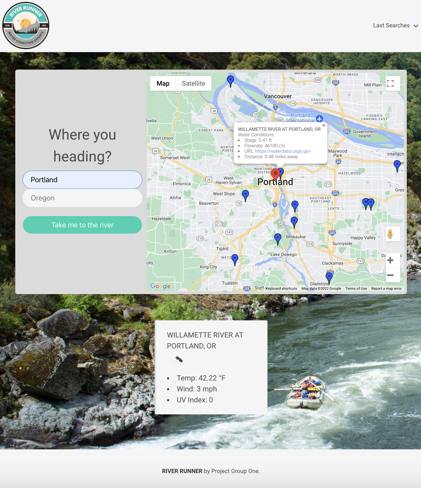

# Group 1 - River Runner Project

## Description
This app was created to aid the user in finding a location in the state of Oregon where they can enjoy water related activities. This application allows the user to input their location and see a hundreds of riverfront locations on a map supplied by Google Maps API. When the user clicks on a blue pin (river locations) they can see relevant real-time water conditions as well as the real-time weather conditions at that location.

## Technologies
The technologies used to accomplish this included the use of USGS WaterServices API, Google Maps API, OpenWeather API, Bulma CSS library, JavaScript and more. 

## User Story
As a group of developers, we want to create an website that helps users find real-time water conditions and weather data from the United States Geological Survey and Openweather.org.  

This is to help them plan out their water related activities (ex. rafting) in Oregon.

## Accepted Criteria

It's done when both API's are fully functioning.

It's done when users are be able to input their location and successfully access data from locations all over Oregon.

It's done when users can select a river in order to see its current weather conditions.

It's done when users can view their past searches.

## Assets

[Link to the deployed application](https://PMengler.github.io/river_runner)

The following image demonstrates the web application's appearance and functionality:

